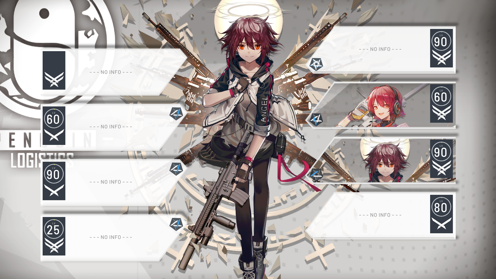
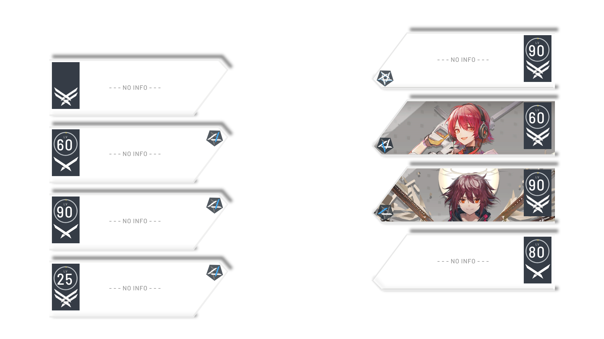

# 八卡模板验收记录

日期：2026-09-16。目标：1920×1080，4 LEFT + 4 RIGHT，透明卡层。

## 阶段结果

| 阶段 | 结果与证据 |
|---|---|
| 单卡 | 主任务通过结构与视觉近似验收；历史iter01–05保留，本轮新增iter06–09。iter06连续暗描边退化后在iter07修正；iter08恢复亮边；iter09补上实际可渲染阴影。失败探针不计入有效迭代。 |
| 左右组件 | 主任务通过；Sol独立检查确认尖角方向正确、文字和角色未镜像、徽章锚点正常。 |
| 四状态 | 主任务通过；Sol独立检查未发现NO INFO残留人物或状态切换位移。 |
| 八卡 | 主任务截图检查与节点读回通过；4左4右、仅06/07持有、其余NO INFO，等级及精英潜能按PSD可见性设置。最终Sol整层复核请求遇到429限流，未取得最终独立结论。 |
| PNG | 19项检查全部通过，详见png_verification.json。 |
| 原生重新打开 | 用户在Pen.dev保存、关闭并重新打开同一文档后，主任务重新get_app_state、Get、TakeScreenshot及Export；八实例与组件均保留，前后导出逐字节相同。 |

## 保存与哈希

- 正式文档：`../character_cards_8slot.pen`
- 文档 SHA-256：`0b374714f8de4b8f4f3e6770749e2c0ee522261f85da80c0494ff251f4f7223d`
- 正式PNG SHA-256：`a799f7fb5a4456e507536f9b728c0d03e6037d3657e6e693f34d85d9bc131d55`
- 重新打开后独立导出：`reopened/Lwq9K.png`，同一PNG哈希。
- 透明内容bbox：`(155,78,1785,1021)`，包含软阴影，完整位于画布内。
- PNG像素检查工具只读Pencil导出，不渲染/生成卡片。命名交付为原样文件复制。

## 参考对照

原始参考包含博士信息和背景；验收只比较角色卡区域。背景仅用于QA画板，不在正式透明PNG中。

### 原始能天使参考

### 重建八卡叠原背景，仅用于比较

### 正式透明八卡层

## 可编辑性与真实边界

外框、局部暗金属边、内侧白边、阴影均为Pen节点。角色为独立路径图像填充；节点外接框包含原始素材区域，其可见路径收敛在卡面内。Get报告的OPERATOR_IMAGE partially clipped来自素材矩形尺寸，不代表实际路径图像被父节点矩形切断，已通过截图检查尖角及肩部。

等级、精英、潜能分组独立，状态不绑定所有徽章。最终画布只含八个组件实例，无背景或博士节点；PNG中心区域及两侧博士区域透明检查通过。

推王与小羊已从真实PSD提取槽06像素素材并替换到相同右卡组件，截图见qa/YYEuj.png。该检查证明不同尺寸、明暗的角色图可替换和裁切，不声称已经为两套源图完成八槽逐像素重建。

## 已知近似和验收范围

字体用Barlow Semi Condensed/Barlow替代Bahnschrift；字体字形、抗锯齿、金属色阶与阴影为视觉近似。NO INFO原图中的浅纹理由原背景透过半透明面板呈现，正式透明层不烘焙原背景。

本交付通过可编辑模板、状态、布局、透明导出和保存重新打开检查；不宣称与PSD像素完全一致。最终整层独立Sol复核未完成，原因是服务429限流，不将其记录为通过。
